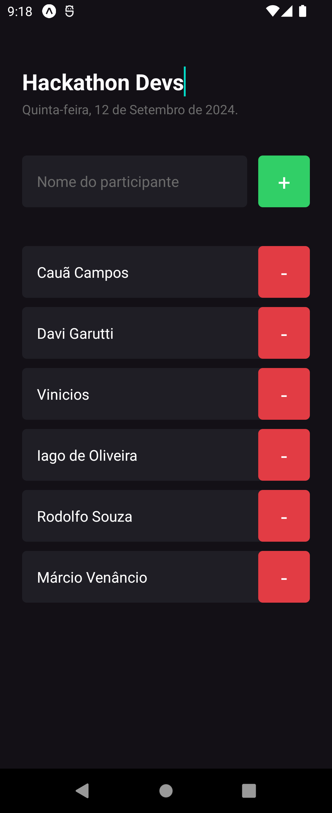

# 🔒Access Control

Access Control é um aplicativo móvel desenvolvido em React Native com Expo, projetado para gerenciar a presença de pessoas em eventos. Com este aplicativo, você pode facilmente adicionar ou remover participantes de uma lista, bem como personalizar o nome do evento e a data.

## 📔Funcionalidades

- Adicionar novos participantes à lista.
- Remover participantes da lista.
- Personalizar o nome do evento.
- Definir a data do evento.

## 💻Tecnologias Utilizadas

- [React Native](https://reactnative.dev/)
- [Expo](https://expo.dev/)

## ✨Pré-requisitos

Antes de começar, certifique-se de ter instalado as seguintes ferramentas:

- [Node.js](https://nodejs.org/)
- [Expo CLI](https://docs.expo.dev/get-started/installation/)

## ❓Como executar o projeto

Siga os passos abaixo para rodar o projeto localmente:

1. **Clone este repositório**

```bash
git clone https://github.com/c4mpos-dev/access-control.git
```

2. **Navegue até o diretório do projeto**

```bash
cd access-control
```
   `Use este comando para mudar para o diretório do projeto que você acabou de clonar.`

3. **Instale as dependências**

```bash
npm install
```

4. **Inicie o servidor de desenvolvimento do Expo**

```bash
npx expo start
```

5. **Execute o aplicativo**

   `Use um dispositivo físico com o aplicativo Expo Go instalado ou um emulador Android/iOS configurado para rodar o projeto.`

## 🏛️Estrutura do Projeto

- **src/**: Contém o código-fonte do aplicativo.
- **assets/**: Imagens e outros recursos estáticos.
- **App.tsx**: Ponto de entrada principal do aplicativo.

## 📝Exemplo de Uso

Após iniciar o aplicativo, você verá a tela principal onde pode:

1. **Adicionar um participante**: Digite o nome do participante e clique em "Adicionar" para incluí-lo na lista.
2. **Remover um participante**: Clique no botão de remoção ao lado do nome do participante que deseja excluir da lista.
3. **Editar informações do evento**: Insira o nome do evento e a data no topo da tela para personalizar o controle de presença.

## 📸Prévia

<div style="display: flex; justify-content: center;">
  <div style="margin: 0 10px;">
    
  </div>
  <div style="margin: 0 10px;">
    
  </div>
</div>